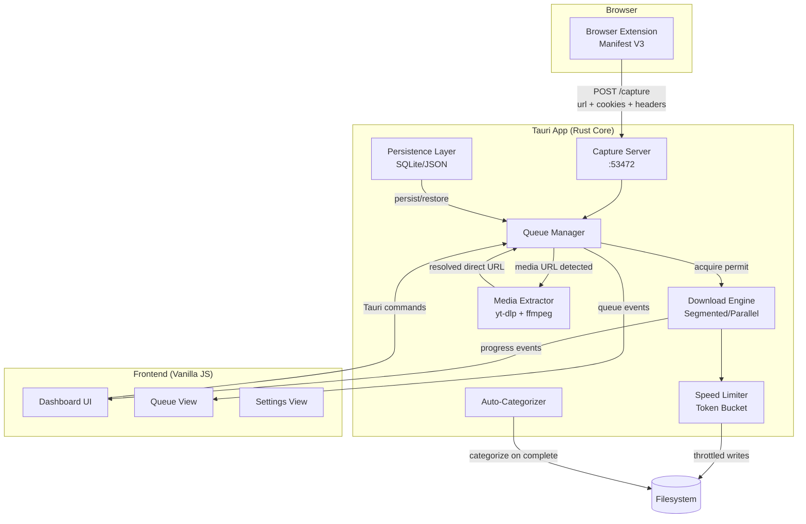
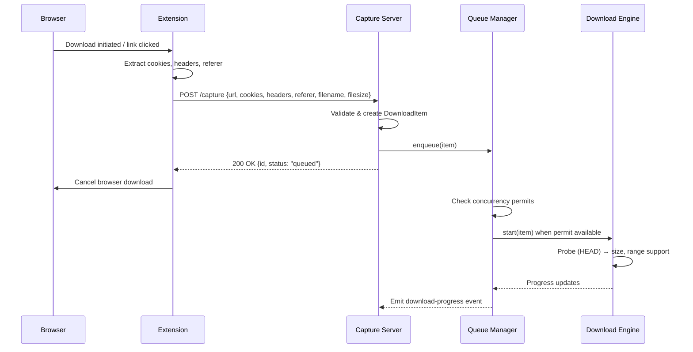
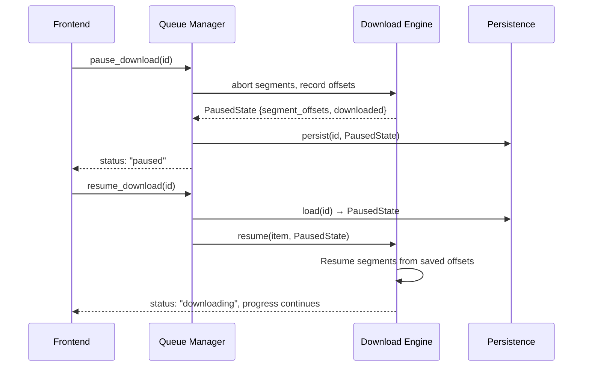
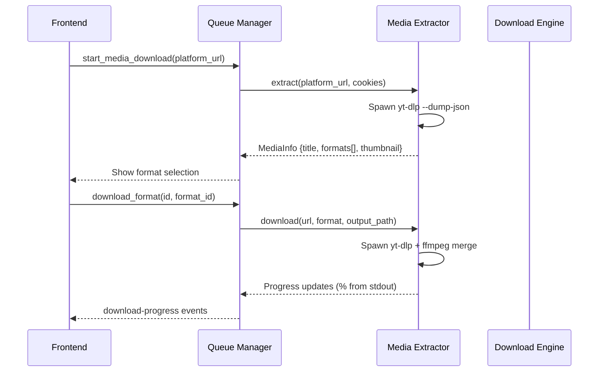

# Design Document: IDM-Style Download Manager

## Overview

Downpour aims to become a full-featured IDM-style download manager built on Tauri 2 (Rust core + vanilla JS UI). This design extends the existing segmented downloader with: enhanced browser extension capture (cookies, headers, referer forwarding), pause/resume with persistence, a wired download queue with concurrency control, speed limiting (bandwidth throttle), auto-categorization by file type, and integration with external tools (yt-dlp + ffmpeg) for permitted video/image downloads from social platforms.

The system keeps a clean separation between the download engine (Rust/Tokio), the queue/scheduler layer, the media extraction layer (external process orchestration), and the UI. The browser extension evolves from simple URL forwarding to full request metadata capture including cookies, custom headers, and content-type sniffing.

All features respect the responsible-use boundary: only content the user is permitted to access is downloaded, no DRM/paywall bypass, and site ToS compliance is maintained.

## Architecture



## Sequence Diagrams

### Browser Capture Flow



### Pause / Resume Flow



### Media Extraction Flow (yt-dlp)



## Components and Interfaces

### Component 1: Enhanced Download Engine (`downloader.rs`)

**Purpose**: Parallel segmented HTTP downloads with pause/resume, speed limiting, and progress reporting.

**Interface**:
```rust
pub struct DownloadItem {
    pub id: String,
    pub url: String,
    pub filename: String,
    pub total_size: u64,
    pub downloaded: u64,
    pub status: DownloadStatus,
    pub category: Option<String>,
    pub created_at: u64,
    pub segments: Vec<SegmentState>,
    pub headers: HashMap<String, String>,
    pub cookies: Option<String>,
    pub speed: u64,           // bytes/sec current
    pub error_message: Option<String>,
}

pub enum DownloadStatus {
    Queued,
    Downloading,
    Paused,
    Complete,
    Error,
    Merging,  // for yt-dlp post-processing
}

pub struct SegmentState {
    pub index: u32,
    pub start: u64,
    pub end: u64,
    pub downloaded: u64,
    pub status: SegmentStatus,
}

pub struct DownloadConfig {
    pub segments: u32,          // default 8
    pub speed_limit: Option<u64>, // bytes/sec, None = unlimited
    pub retry_count: u32,
    pub retry_delay_ms: u64,
}

pub trait DownloadEngine {
    async fn start(&self, item: &DownloadItem, config: &DownloadConfig) -> Result<()>;
    async fn pause(&self, id: &str) -> Result<PausedState>;
    async fn resume(&self, id: &str, state: PausedState) -> Result<()>;
    async fn cancel(&self, id: &str) -> Result<()>;
}
```

**Responsibilities**:
- Probe URLs (HEAD request) for size and range support
- Split downloads into configurable segments (1-32)
- Download segments in parallel with per-segment progress tracking
- Apply speed limiting via token bucket algorithm
- Support pause (abort + record offsets) and resume (seek + continue)
- Forward custom headers and cookies from browser capture
- Retry failed segments with exponential backoff

### Component 2: Queue Manager (`queue.rs`)

**Purpose**: Controls download concurrency, scheduling, priority, and persistence.

**Interface**:
```rust
pub struct QueueManager {
    downloads: Downloads,
    semaphore: Arc<Semaphore>,
    config: QueueConfig,
    persistence: PersistenceLayer,
}

pub struct QueueConfig {
    pub max_concurrent: usize,     // default 3
    pub max_retries: u32,
    pub auto_start: bool,
    pub speed_limit_global: Option<u64>,
}

impl QueueManager {
    pub async fn enqueue(&self, item: DownloadItem) -> Result<String>;
    pub async fn pause(&self, id: &str) -> Result<()>;
    pub async fn resume(&self, id: &str) -> Result<()>;
    pub async fn cancel(&self, id: &str) -> Result<()>;
    pub async fn remove(&self, id: &str) -> Result<()>;
    pub async fn reorder(&self, id: &str, position: usize) -> Result<()>;
    pub async fn set_max_concurrent(&self, n: usize);
    pub async fn set_speed_limit(&self, limit: Option<u64>);
    pub async fn pause_all(&self) -> Result<()>;
    pub async fn resume_all(&self) -> Result<()>;
    pub async fn get_queue_state(&self) -> Vec<DownloadItem>;
    pub async fn restore_from_disk(&self) -> Result<()>;
}
```

**Responsibilities**:
- Semaphore-based concurrency control (configurable max concurrent)
- FIFO scheduling with manual reordering
- Persist queue state to disk (survive restarts)
- Auto-resume queued/paused downloads on app launch
- Global and per-download speed limiting coordination
- Emit queue-level events (queue-changed, download-started, download-completed)

### Component 3: Media Extractor (`media_extractor.rs`)

**Purpose**: Orchestrate yt-dlp and ffmpeg for video/image downloads from supported platforms.

**Interface**:
```rust
pub struct MediaExtractor {
    ytdlp_path: PathBuf,
    ffmpeg_path: PathBuf,
}

pub struct MediaInfo {
    pub title: String,
    pub thumbnail: Option<String>,
    pub duration: Option<u64>,
    pub formats: Vec<MediaFormat>,
    pub platform: String,
}

pub struct MediaFormat {
    pub format_id: String,
    pub ext: String,
    pub quality: String,  // "1080p", "720p", "best", etc.
    pub filesize: Option<u64>,
    pub has_video: bool,
    pub has_audio: bool,
}

impl MediaExtractor {
    pub async fn check_availability(&self) -> ExtractorStatus;
    pub async fn extract_info(&self, url: &str, cookies: Option<&str>) -> Result<MediaInfo>;
    pub async fn download(
        &self,
        url: &str,
        format_id: &str,
        output_path: &Path,
        progress_tx: Sender<MediaProgress>,
    ) -> Result<()>;
    pub async fn extract_images(&self, url: &str, cookies: Option<&str>) -> Result<Vec<ImageInfo>>;
}
```

**Responsibilities**:
- Detect yt-dlp and ffmpeg binary availability (bundled or system PATH)
- Extract media metadata without downloading (--dump-json)
- Spawn yt-dlp as child process with stdout progress parsing
- Support format selection (quality, audio-only, video-only)
- Parse yt-dlp progress output and forward to UI
- Respect responsible-use boundary (no DRM bypass flags)
- Batch image extraction from gallery/album pages

### Component 4: Enhanced Browser Extension (`extension/`)

**Purpose**: Intercept browser downloads and capture full request context (cookies, headers, referer).

**Interface**:
```javascript
// Capture payload sent to desktop app
interface CapturePayload {
  url: string;
  filename: string | null;
  filesize: number | null;
  mimeType: string | null;
  cookies: string | null;      // Cookie header value for the domain
  headers: Record<string, string>;
  referer: string | null;
  pageUrl: string | null;      // URL of the page that initiated download
  isMedia: boolean;            // hint: detected as video/image
}

// Extension background API
interface ExtensionCapture {
  interceptDownload(item: chrome.downloads.DownloadItem): Promise<void>;
  captureMediaLink(url: string, tabId: number): Promise<void>;
  getPageCookies(url: string): Promise<string>;
  detectMediaOnPage(tabId: number): Promise<MediaLink[]>;
}
```

**Responsibilities**:
- Intercept downloads via `chrome.downloads.onCreated`
- Extract cookies for the download domain via `chrome.cookies.getAll`
- Capture referer and page URL from the active tab
- Detect media links on page (video/image sources) via content script
- Size/type filtering (e.g., skip tiny favicon downloads)
- User-configurable capture rules (file types, size thresholds, domain whitelist/blacklist)

### Component 5: Auto-Categorizer (`categorizer.rs`)

**Purpose**: Automatically sort completed downloads into category folders.

**Interface**:
```rust
pub struct Categorizer {
    rules: Vec<CategoryRule>,
}

pub struct CategoryRule {
    pub category: String,        // "Videos", "Images", "Documents", etc.
    pub extensions: Vec<String>, // [".mp4", ".mkv", ".avi"]
    pub mime_patterns: Vec<String>,
    pub subfolder: String,       // relative to downloads dir
}

impl Categorizer {
    pub fn categorize(&self, filename: &str, mime: Option<&str>) -> Option<&str>;
    pub async fn move_to_category(&self, file_path: &Path, category: &str) -> Result<PathBuf>;
}
```

**Responsibilities**:
- Map file extensions and MIME types to categories
- Default categories: Videos, Music, Images, Documents, Archives, Programs, Other
- Move/rename files on completion
- User-configurable rules via settings

### Component 6: Speed Limiter (`speed_limiter.rs`)

**Purpose**: Token-bucket rate limiter for bandwidth throttling.

**Interface**:
```rust
pub struct SpeedLimiter {
    rate: Arc<AtomicU64>,         // bytes per second (0 = unlimited)
    tokens: Arc<AtomicU64>,
}

impl SpeedLimiter {
    pub fn new(bytes_per_sec: u64) -> Self;
    pub fn set_rate(&self, bytes_per_sec: u64);
    pub async fn acquire(&self, bytes: u64);  // blocks until tokens available
    pub fn current_rate(&self) -> u64;
}
```

**Responsibilities**:
- Token bucket algorithm with configurable refill rate
- Global limiter shared across all active downloads
- Per-download limiter option
- Dynamic rate adjustment without restart
- Fair distribution across concurrent segments

### Component 7: Persistence Layer (`persistence.rs`)

**Purpose**: Persist download state, queue, and settings across app restarts.

**Interface**:
```rust
pub struct PersistenceLayer {
    db_path: PathBuf,
}

impl PersistenceLayer {
    pub async fn save_download(&self, item: &DownloadItem) -> Result<()>;
    pub async fn save_segment_state(&self, id: &str, segments: &[SegmentState]) -> Result<()>;
    pub async fn load_all_downloads(&self) -> Result<Vec<DownloadItem>>;
    pub async fn load_segments(&self, id: &str) -> Result<Vec<SegmentState>>;
    pub async fn save_settings(&self, settings: &AppSettings) -> Result<()>;
    pub async fn load_settings(&self) -> Result<AppSettings>;
    pub async fn delete_download(&self, id: &str) -> Result<()>;
}
```

**Responsibilities**:
- Store download metadata and segment offsets (JSON file or SQLite)
- Restore in-progress downloads on app restart
- Persist user settings (speed limits, concurrent downloads, categories)
- Clean up stale entries (orphaned temp files)

## Data Models

### DownloadItem (Enhanced)

```rust
#[derive(Clone, Serialize, Deserialize)]
pub struct DownloadItem {
    pub id: String,
    pub url: String,
    pub filename: String,
    pub total_size: u64,
    pub downloaded: u64,
    pub status: String,           // "queued"|"downloading"|"paused"|"complete"|"error"|"merging"
    pub category: Option<String>, // auto-categorized label
    pub created_at: u64,          // unix timestamp
    pub completed_at: Option<u64>,
    pub speed: u64,               // current bytes/sec
    pub segments: u32,            // number of segments used
    pub error_message: Option<String>,
    pub headers: HashMap<String, String>,
    pub cookies: Option<String>,
    pub referer: Option<String>,
    pub is_resumable: bool,
    pub download_type: String,    // "http"|"media"|"batch"
}
```

**Validation Rules**:
- `url` must be valid HTTP/HTTPS URL
- `segments` must be 1-32
- `status` must be one of the defined enum values
- `total_size` is 0 until probe completes

### AppSettings

```rust
#[derive(Clone, Serialize, Deserialize)]
pub struct AppSettings {
    pub download_dir: PathBuf,
    pub max_concurrent: usize,       // 1-10, default 3
    pub default_segments: u32,       // 1-32, default 8
    pub speed_limit: Option<u64>,    // bytes/sec, None = unlimited
    pub auto_categorize: bool,
    pub categories: Vec<CategoryRule>,
    pub auto_start_queue: bool,
    pub minimize_to_tray: bool,
    pub notifications_enabled: bool,
    pub capture_min_size: u64,       // minimum file size to capture (bytes)
    pub capture_extensions: Vec<String>, // extensions to capture (empty = all)
    pub ytdlp_path: Option<PathBuf>,
    pub ffmpeg_path: Option<PathBuf>,
}
```

**Validation Rules**:
- `max_concurrent` between 1 and 10
- `default_segments` between 1 and 32
- `speed_limit` if Some, must be > 0
- `download_dir` must exist or be creatable

## Algorithmic Pseudocode

### Token Bucket Speed Limiter

```rust
// Token bucket algorithm for bandwidth throttling
// Tokens represent bytes that can be transmitted

struct TokenBucket {
    capacity: u64,          // max burst size (1 second worth of tokens)
    tokens: AtomicU64,      // current available tokens
    rate: AtomicU64,        // refill rate (bytes/sec)
    last_refill: AtomicU64, // timestamp of last refill (ms)
}

impl TokenBucket {
    /// Acquire `n` bytes worth of tokens, blocking until available.
    /// Precondition: n > 0
    /// Postcondition: returns only when n tokens consumed; overall throughput ≤ rate
    async fn acquire(&self, n: u64) {
        loop {
            self.refill();
            let current = self.tokens.load(Ordering::Relaxed);
            if current >= n {
                if self.tokens.compare_exchange(current, current - n, ...).is_ok() {
                    return; // tokens acquired
                }
            } else {
                // Wait for refill: sleep proportional to deficit
                let deficit = n - current;
                let rate = self.rate.load(Ordering::Relaxed);
                if rate == 0 { return; } // unlimited
                let wait_ms = (deficit * 1000) / rate;
                tokio::time::sleep(Duration::from_millis(wait_ms.max(1))).await;
            }
        }
    }

    /// Refill tokens based on elapsed time since last refill.
    /// Invariant: tokens never exceed capacity
    fn refill(&self) {
        let now = current_time_ms();
        let last = self.last_refill.swap(now, Ordering::Relaxed);
        let elapsed_ms = now.saturating_sub(last);
        let rate = self.rate.load(Ordering::Relaxed);
        let new_tokens = (rate * elapsed_ms) / 1000;
        if new_tokens > 0 {
            let current = self.tokens.fetch_add(new_tokens, Ordering::Relaxed);
            // Cap at capacity
            let cap = self.capacity.load(Ordering::Relaxed);
            if current + new_tokens > cap {
                self.tokens.store(cap, Ordering::Relaxed);
            }
        }
    }
}
```

**Preconditions:**
- `n > 0` (requesting at least 1 byte)
- `rate > 0` when limiting is active (rate = 0 means unlimited)

**Postconditions:**
- Returns only after `n` tokens have been consumed
- Average throughput over time ≤ configured `rate`
- Burst allowance up to `capacity` bytes

**Loop Invariant:**
- `tokens ≤ capacity` after every refill
- Elapsed time tracking monotonically increases

### Segmented Download with Pause/Resume

```rust
/// Download with pause/resume support.
/// Each segment tracks its own progress independently.
async fn download_segmented(
    id: &str,
    url: &str,
    dest: &Path,
    total_size: u64,
    num_segments: u32,
    resume_state: Option<Vec<SegmentState>>,
    limiter: &SpeedLimiter,
    cancel_token: CancellationToken,
) -> Result<DownloadResult> {
    // ALGORITHM:
    // 1. If resuming: load segment offsets; else: compute fresh splits
    // 2. Pre-allocate file to total_size
    // 3. Spawn one task per segment
    // 4. Each segment: seek to (start + already_downloaded), stream bytes
    // 5. Before each write: acquire tokens from speed limiter
    // 6. On cancel_token fired: abort all segments, return PausedState
    // 7. On all complete: verify total bytes == total_size

    let segments = match resume_state {
        Some(saved) => saved,
        None => compute_segments(total_size, num_segments),
    };

    // Pre-allocate
    let file = File::create(dest).await?;
    file.set_len(total_size).await?;

    let tasks: Vec<_> = segments.iter().map(|seg| {
        let cancel = cancel_token.clone();
        tokio::spawn(async move {
            download_one_segment(seg, url, dest, limiter, cancel).await
        })
    }).collect();

    // Wait for all or cancellation
    select! {
        results = join_all(tasks) => {
            // All segments complete
            verify_file_integrity(dest, total_size)?;
            Ok(DownloadResult::Complete)
        }
        _ = cancel_token.cancelled() => {
            // Collect current segment states for resume
            let paused = collect_segment_states(&tasks);
            Ok(DownloadResult::Paused(paused))
        }
    }
}
```

**Preconditions:**
- `total_size > 0` and server supports Range requests (already probed)
- `num_segments ∈ [1, 32]`
- `dest` parent directory exists and is writable
- If `resume_state` provided: segment ranges match the file

**Postconditions:**
- On `Complete`: file at `dest` has exactly `total_size` bytes, all bytes written correctly
- On `Paused`: each segment's current offset is persisted, partial file is valid up to written offsets
- On error: status set to "error", partial file may remain for retry

**Loop Invariant (per segment):**
- `seg.downloaded ≤ (seg.end - seg.start + 1)` at all times
- File write position = `seg.start + seg.downloaded`
- Total tokens consumed from limiter = total bytes written across all segments

### Queue Scheduling Algorithm

```rust
/// Queue manager scheduling loop.
/// Runs continuously, starting queued downloads when permits are available.
async fn scheduler_loop(
    queue: &QueueManager,
    cancel: CancellationToken,
) {
    // ALGORITHM:
    // 1. On each tick or queue change event:
    //    a. Count active downloads (status == "downloading")
    //    b. If active < max_concurrent:
    //       - Find next "queued" item in order
    //       - Acquire semaphore permit
    //       - Start download
    //    c. If download finishes: release permit, check queue again
    // 2. On settings change: update semaphore capacity dynamically

    loop {
        select! {
            _ = queue.notify.notified() => {},
            _ = tokio::time::sleep(Duration::from_secs(1)) => {},
            _ = cancel.cancelled() => break,
        }

        let items = queue.get_items_by_status("queued").await;
        for item in items {
            if let Ok(permit) = queue.semaphore.try_acquire() {
                spawn_download(item, permit, queue).await;
            } else {
                break; // no more permits available
            }
        }
    }
}
```

**Preconditions:**
- Queue manager is initialized with valid semaphore
- At least one download in "queued" status triggers scheduling

**Postconditions:**
- Active downloads never exceed `max_concurrent`
- Downloads start in FIFO order (unless reordered)
- Permits are released on completion, pause, or error

**Loop Invariant:**
- `active_downloads ≤ semaphore_capacity` at all times
- All "queued" items will eventually be started (liveness guarantee)

## Key Functions with Formal Specifications

### `capture_server::capture()` — Enhanced

```rust
async fn capture(
    State(ctx): State<Ctx>,
    Json(req): Json<CaptureReq>,
) -> Result<Json<DownloadItem>, StatusCode>
```

**Preconditions:**
- `req.url` is a valid HTTP/HTTPS URL
- Capture server is running and accepting connections
- `req.url` length ≤ 2048 characters

**Postconditions:**
- Returns `DownloadItem` with status "queued"
- Item is inserted into the downloads map
- Item is enqueued in the queue manager
- `download-progress` event emitted to UI
- If `req.cookies` provided, they are attached to the download item

### `queue::enqueue()` — Add to Queue

```rust
pub async fn enqueue(&self, item: DownloadItem) -> Result<String>
```

**Preconditions:**
- `item.id` is unique (not already in queue)
- `item.url` is valid
- `item.status == "queued"`

**Postconditions:**
- Item added to queue in last position
- Queue state persisted to disk
- Scheduler notified (may start download immediately if permits available)
- Returns the item's id

### `downloader::pause()` — Pause Download

```rust
pub async fn pause(&self, id: &str) -> Result<PausedState>
```

**Preconditions:**
- Download with `id` exists and `status == "downloading"`
- Download is using segmented mode (single-stream can also pause via byte count)

**Postconditions:**
- All active segment tasks are cancelled
- `PausedState` contains per-segment byte offsets
- Download status set to "paused"
- Semaphore permit released (slot freed for next queued item)
- Partial file on disk is valid up to recorded offsets
- State persisted to disk

### `media_extractor::extract_info()` — Get Media Metadata

```rust
pub async fn extract_info(&self, url: &str, cookies: Option<&str>) -> Result<MediaInfo>
```

**Preconditions:**
- `url` is a valid platform URL
- yt-dlp binary is available at configured path
- If `cookies` provided, they are in Netscape cookie format

**Postconditions:**
- Returns `MediaInfo` with at least one format option
- No data downloaded (metadata only, uses `--dump-json`)
- Process spawned and completed (no lingering child processes)
- If URL is unsupported: returns descriptive error

### `speed_limiter::acquire()` — Token Acquisition

```rust
pub async fn acquire(&self, bytes: u64)
```

**Preconditions:**
- `bytes > 0`
- Limiter is initialized

**Postconditions:**
- Returns only after `bytes` tokens consumed
- If rate == 0 (unlimited): returns immediately
- Average throughput ≤ configured rate over any 1-second window
- Does not starve: every caller eventually gets tokens (fairness)

## Example Usage

### Starting a Download via Extension Capture

```rust
// Extension sends enhanced payload to capture server
// POST http://127.0.0.1:53472/capture
let payload = CaptureReq {
    url: "https://example.com/file.zip".into(),
    filename: Some("file.zip".into()),
    filesize: Some(104857600), // 100MB
    cookies: Some("session=abc123; token=xyz".into()),
    headers: HashMap::from([
        ("Referer".into(), "https://example.com/downloads".into()),
    ]),
    mime_type: Some("application/zip".into()),
};

// Server creates item, enqueues it, responds immediately
// Queue manager picks it up when permit available
// Download starts with 8 segments, forwarding cookies + headers
```

### Pause and Resume

```rust
// User clicks pause in UI
let paused = invoke("pause_download", { id: "abc-123" }).await;
// → status: "paused", segments saved to disk

// Later: user clicks resume (or app restarts)
let resumed = invoke("resume_download", { id: "abc-123" }).await;
// → segments resume from saved offsets, status: "downloading"
```

### Media Download (yt-dlp)

```javascript
// User pastes a video URL from a permitted source
const info = await invoke("extract_media_info", { url: "https://example.com/video/123" });
// → { title: "My Video", formats: [{quality: "1080p", ext: "mp4", ...}] }

// User selects format
await invoke("start_media_download", {
    url: "https://example.com/video/123",
    formatId: "best",
    outputDir: "/Users/me/Videos"
});
// → Progress events stream to UI as yt-dlp downloads + merges
```

### Speed Limiting

```javascript
// Set global speed limit to 5 MB/s
await invoke("set_speed_limit", { bytesPerSec: 5242880 });

// Remove limit
await invoke("set_speed_limit", { bytesPerSec: 0 }); // 0 = unlimited
```

## Correctness Properties

*A property is a characteristic or behavior that should hold true across all valid executions of a system — essentially, a formal statement about what the system should do. Properties serve as the bridge between human-readable specifications and machine-verifiable correctness guarantees.*

### Property 1: Segment coverage is total and non-overlapping

*For any* file size > 0 and segment count in [1, 32], the computed segment ranges SHALL cover exactly [0, total_size) with no gaps and no overlaps between segments.

**Validates: Requirement 1.1**

### Property 2: Download progress invariant

*For any* DownloadItem at any point during its lifecycle, the reported `downloaded` bytes SHALL never exceed `total_size`.

**Validates: Requirements 1.5, 12.4**

### Property 3: Pause/resume produces identical output

*For any* download paused at any arbitrary progress point, resuming and completing the download SHALL produce a file byte-for-byte identical to one downloaded without interruption.

**Validates: Requirements 2.1, 2.2, 2.4**

### Property 4: Queue concurrency invariant

*For any* sequence of enqueue, start, pause, complete, cancel, and error operations, the number of downloads with status "downloading" SHALL never exceed the configured max_concurrent limit.

**Validates: Requirements 3.1, 10.4**

### Property 5: Queue scheduling respects FIFO order

*For any* set of N downloads enqueued sequentially (without reordering), they SHALL be started in insertion order as concurrency permits become available.

**Validates: Requirement 3.2**

### Property 6: Queue reorder is respected

*For any* queue state and valid reorder operation, subsequent scheduling decisions SHALL respect the new ordering.

**Validates: Requirement 3.3**

### Property 7: Speed limiter throughput bound

*For any* configured rate > 0 and any time window of 1 second, the total bytes passed through the Speed_Limiter SHALL not exceed the configured rate plus one burst capacity (one second's worth of tokens).

**Validates: Requirement 4.1**

### Property 8: Speed limiter fairness

*For any* set of N concurrent consumers sharing the Speed_Limiter, each consumer SHALL receive approximately rate/N throughput over any sufficiently long time window (no starvation).

**Validates: Requirement 4.4**

### Property 9: Persistence round-trip for downloads

*For any* valid DownloadItem with arbitrary segment states, serializing to disk and deserializing back SHALL produce an equivalent DownloadItem with identical field values.

**Validates: Requirements 5.1, 5.2**

### Property 10: Persistence round-trip for settings

*For any* valid AppSettings configuration, serializing to disk and deserializing back SHALL produce an equivalent AppSettings with identical field values.

**Validates: Requirement 5.4**

### Property 11: Captured metadata flows through to HTTP requests

*For any* capture payload containing cookies and headers, those values SHALL be preserved on the resulting DownloadItem and SHALL be included in every HTTP request made by the Download_Engine for that download.

**Validates: Requirements 6.3, 6.4**

### Property 12: Extension capture filtering correctness

*For any* file size and file extension, the Browser_Extension filter SHALL accept the download if and only if the size meets the minimum threshold and the extension is not in the blacklist (or is in the whitelist when configured).

**Validates: Requirement 6.5**

### Property 13: Auto-categorizer totality

*For any* valid filename, the Auto_Categorizer SHALL map it to exactly one category — the matching category if the extension is in a category rule, or "Other" if no rule matches.

**Validates: Requirements 7.1, 7.3, 7.4**

### Property 14: yt-dlp progress parser correctness

*For any* well-formed yt-dlp progress output line, the parser SHALL correctly extract the download percentage, speed, and ETA values.

**Validates: Requirement 8.3**

### Property 15: Media extractor never passes forbidden flags

*For any* media download configuration, the constructed yt-dlp command SHALL never include DRM-bypass flags or --cookies-from-browser.

**Validates: Requirement 8.6**

### Property 16: URL scheme validation

*For any* URL string, the Capture_Server SHALL accept it if and only if the scheme is http or https, rejecting all other schemes (file, javascript, data, ftp, etc.).

**Validates: Requirement 9.4**

### Property 17: Retry backoff is exponential and capped

*For any* retry attempt number n, the computed delay SHALL equal min(2^n * base_delay, 30_000ms), producing exponential backoff capped at 30 seconds.

**Validates: Requirement 10.1**

### Property 18: Filename sanitization removes dangerous characters

*For any* input string, the sanitized filename SHALL not contain path traversal sequences ("../", "..\\"), null bytes, or control characters (ASCII 0-31).

**Validates: Requirement 10.5**

### Property 19: Settings validation rejects out-of-bounds values

*For any* integer value, max_concurrent SHALL be accepted if and only if it is in [1, 10]; default_segments SHALL be accepted if and only if it is in [1, 32]; speed_limit SHALL be accepted if and only if it is >= 0.

**Validates: Requirements 11.1, 11.2, 11.3**

### Property 20: Progress event throttling

*For any* active download over any 1-second time window, the Download_Engine SHALL emit at most 3 progress events for that download.

**Validates: Requirement 12.2**

## Error Handling

### Error Scenario 1: Network Interruption Mid-Download

**Condition**: TCP connection drops during segment download
**Response**: Mark segment as failed, retry with exponential backoff (1s, 2s, 4s, up to 30s)
**Recovery**: Resume from last successful byte offset within segment; after max retries, mark download as "error" with descriptive message

### Error Scenario 2: Server Does Not Support Range (On Resume)

**Condition**: Server previously supported Range but now returns 200 instead of 206
**Response**: Detect via response status code; cannot resume segments
**Recovery**: Restart download from scratch in single-stream mode; notify user that resume was not possible

### Error Scenario 3: Disk Full

**Condition**: Write fails with ENOSPC during download
**Response**: Pause all active downloads immediately, emit error event
**Recovery**: User frees disk space, then resumes; segment state preserved so no data loss

### Error Scenario 4: yt-dlp Not Found

**Condition**: Media download requested but yt-dlp binary not at configured path
**Response**: Return clear error message with setup instructions
**Recovery**: User installs yt-dlp or configures correct path in settings; retry extraction

### Error Scenario 5: Capture Server Port Conflict

**Condition**: Port 53472 already in use when app starts
**Response**: Log error, retry with exponential backoff, notify user via system notification
**Recovery**: Previous instance closes or user kills conflicting process; server binds on retry

### Error Scenario 6: Corrupted Persistence File

**Condition**: JSON/SQLite file corrupted (partial write, crash)
**Response**: Detect via parse error, back up corrupted file
**Recovery**: Start fresh queue; partially downloaded files remain on disk for manual recovery

## Testing Strategy

### Unit Testing Approach

- **Speed limiter**: Verify token bucket math (acquire blocks appropriately, refill correct)
- **Categorizer**: Test extension → category mapping with edge cases
- **Segment computation**: Verify segment boundaries cover entire file with no gaps/overlaps
- **Filename extraction**: Test URL parsing with query strings, fragments, encoded characters
- **Settings validation**: Verify bounds checking on all configurable values

### Property-Based Testing Approach

**Property Test Library**: `proptest` (Rust)

- **Segment coverage property**: For any file size and segment count, generated segments cover exactly [0, total_size) with no gaps or overlaps
- **Speed limiter throughput**: Over any time window, actual throughput ≤ configured rate + one burst
- **Pause/resume idempotency**: pause then resume produces same final result as uninterrupted download
- **Categorizer totality**: Every valid filename maps to exactly one category (or "Other")
- **Queue ordering**: Enqueue N items → dequeue order matches insertion order (FIFO)

### Integration Testing Approach

- **End-to-end capture flow**: Extension POST → capture server → queue → download → file on disk
- **Pause/resume cycle**: Start download, pause at ~50%, resume, verify final file checksum
- **Concurrent downloads**: Start N+1 downloads with max_concurrent=N, verify only N run simultaneously
- **yt-dlp integration**: Mock yt-dlp output, verify progress parsing and file handling
- **Persistence round-trip**: Save state, kill app, restart, verify queue restored correctly

## Performance Considerations

- **Segment count**: Default 8 segments provides good parallelism without overwhelming servers; configurable up to 32 for high-bandwidth connections
- **Progress reporting**: Throttle UI events to max 3/sec per download (avoid flooding the webview)
- **Token bucket granularity**: Refill every 100ms for smooth throttling without excessive CPU wake-ups
- **Memory**: Stream download chunks (64KB buffers) rather than buffering entire segments in memory
- **File I/O**: Use pre-allocation (`set_len`) to avoid filesystem fragmentation; write with `O_DIRECT` where supported
- **Queue persistence**: Batch writes (debounce 500ms) to avoid excessive disk I/O on rapid progress updates
- **yt-dlp spawning**: Reuse extracted metadata; don't re-spawn for format listing after initial extraction

## Security Considerations

- **Capture server**: Bind only to `127.0.0.1` (localhost); reject non-local connections
- **URL validation**: Sanitize URLs before passing to download engine; reject file://, javascript:, data: schemes
- **Cookie handling**: Store cookies only in memory during download; never persist to disk in plaintext
- **yt-dlp flags**: Never pass `--rm-cache-dir`, `--cookies-from-browser`, or DRM-bypass flags
- **File paths**: Sanitize filenames to prevent path traversal (strip `../`, null bytes, control characters)
- **Extension permissions**: Minimal manifest permissions; only request cookies for domains being downloaded
- **Child process security**: Validate yt-dlp/ffmpeg binary paths; don't execute arbitrary paths

## Dependencies

### Rust (Backend)

| Crate | Purpose |
|-------|---------|
| `tauri` 2.x | App framework |
| `tokio` | Async runtime (already present) |
| `reqwest` | HTTP client with streaming (already present) |
| `axum` + `tower-http` | Capture server (already present) |
| `serde` / `serde_json` | Serialization (already present) |
| `uuid` | Download IDs (already present) |
| `anyhow` | Error handling (already present) |
| `dirs` | Platform directories (already present) |
| `tokio-util` | CancellationToken for pause/resume |
| `chrono` | Timestamps |
| `proptest` | Property-based testing (dev) |

### External Binaries

| Binary | Purpose | Distribution |
|--------|---------|-------------|
| `yt-dlp` | Media extraction + download | Bundled or user-installed |
| `ffmpeg` | Audio/video merging | Bundled or user-installed |

### Frontend

| Package | Purpose |
|---------|---------|
| `@tauri-apps/api` | Tauri IPC (already present) |
| `vite` | Build tooling (already present) |

### Browser Extension

- Manifest V3 APIs: `chrome.downloads`, `chrome.cookies`, `chrome.tabs`, `chrome.webRequest` (optional, for header capture)


## UI/UX Design

### Design System & Visual Language

Downpour uses a **Glassmorphism / Fluent Design** aesthetic: translucent layered panels with backdrop-blur, subtle luminous borders, and depth via stacked semi-transparent surfaces. The design adapts per-platform:

- **Windows 11**: Mica/Acrylic material via Tauri's `window.set_effects()` (WindowEffect::Mica or Acrylic). The app window itself becomes translucent, and inner panels layer on top.
- **macOS**: NSVisualEffectView vibrancy (`WindowEffect::UnderWindowBackground` or `Sidebar`) for native frosted-glass feel.
- **Linux**: CSS-only glassmorphism fallback — solid dark base (`#0a0c10`) with `backdrop-filter: blur()` on panel elements. No native compositor integration assumed.

All platforms share the same CSS; platform-specific window transparency is handled in the Rust Tauri setup. The CSS glass effect is the universal baseline that works everywhere.

**Design Principles:**
- Depth through translucency — panels float above a dark canvas
- Subtle borders (1px, semi-transparent white) to separate layers
- Soft shadows and glow effects for interactive elements
- Minimal chrome — content takes priority
- Consistent 4px spacing grid (4, 8, 12, 16, 20, 24, 32, 40, 48)

---

### Color Palette

#### Dark Mode (Default & Primary)

```css
:root {
  /* ── Base surfaces ── */
  --bg-base: #0a0c10;                      /* deepest background */
  --bg-elevated: rgba(20, 23, 30, 0.75);   /* glass panels */
  --bg-surface: rgba(28, 32, 42, 0.60);    /* cards, items */
  --bg-overlay: rgba(10, 12, 16, 0.85);    /* modals backdrop */

  /* ── Glass effect ── */
  --glass-bg: rgba(22, 26, 35, 0.65);
  --glass-border: rgba(255, 255, 255, 0.08);
  --glass-border-hover: rgba(255, 255, 255, 0.14);
  --glass-blur: 20px;
  --glass-shadow: 0 8px 32px rgba(0, 0, 0, 0.4);

  /* ── Accent (Electric Violet) ── */
  --accent: #7c5cfc;
  --accent-hover: #9278ff;
  --accent-glow: rgba(124, 92, 252, 0.35);
  --accent-subtle: rgba(124, 92, 252, 0.12);
  --accent-text: #b4a0ff;

  /* ── Status colors ── */
  --status-downloading: #4aa8ff;
  --status-downloading-glow: rgba(74, 168, 255, 0.30);
  --status-complete: #36d399;
  --status-complete-glow: rgba(54, 211, 153, 0.25);
  --status-paused: #f5b942;
  --status-paused-glow: rgba(245, 185, 66, 0.25);
  --status-error: #f87272;
  --status-error-glow: rgba(248, 114, 114, 0.25);
  --status-queued: #8b93a1;

  /* ── Text hierarchy ── */
  --text-primary: #edf0f5;
  --text-secondary: #a8b1bf;
  --text-muted: #5f6875;
  --text-inverse: #0a0c10;

  /* ── Borders ── */
  --border-subtle: rgba(255, 255, 255, 0.06);
  --border-default: rgba(255, 255, 255, 0.10);
  --border-strong: rgba(255, 255, 255, 0.18);

  /* ── Spacing ── */
  --radius-sm: 8px;
  --radius-md: 12px;
  --radius-lg: 16px;
  --radius-xl: 20px;

  /* ── Sidebar ── */
  --sidebar-width: 220px;
  --sidebar-collapsed: 56px;
}
```

#### Light Mode (Future — CSS structure supports it)

```css
[data-theme="light"] {
  --bg-base: #f0f2f5;
  --bg-elevated: rgba(255, 255, 255, 0.80);
  --bg-surface: rgba(255, 255, 255, 0.60);
  --glass-bg: rgba(255, 255, 255, 0.70);
  --glass-border: rgba(0, 0, 0, 0.08);
  --text-primary: #1a1d24;
  --text-secondary: #4a5060;
  --text-muted: #8b93a1;
}
```

---

### Typography

```css
:root {
  /* ── Font stacks ── */
  --font-system: -apple-system, BlinkMacSystemFont, "Segoe UI Variable",
                 "Segoe UI", system-ui, Roboto, "Helvetica Neue", sans-serif;
  --font-mono: "SF Mono", "Cascadia Code", "JetBrains Mono",
               "Fira Code", Consolas, monospace;

  /* ── Size scale ── */
  --text-xs: 11px;      /* captions, badges */
  --text-sm: 12px;      /* metadata, secondary info */
  --text-base: 14px;    /* body text, labels */
  --text-md: 15px;      /* download filenames */
  --text-lg: 18px;      /* section headers */
  --text-xl: 22px;      /* page titles */
  --text-2xl: 28px;     /* hero/splash (unused typically) */

  /* ── Line heights ── */
  --leading-tight: 1.2;
  --leading-normal: 1.5;
  --leading-relaxed: 1.7;

  /* ── Font weights ── */
  --weight-normal: 400;
  --weight-medium: 500;
  --weight-semibold: 600;
  --weight-bold: 700;
}

body {
  font-family: var(--font-system);
  font-size: var(--text-base);
  line-height: var(--leading-normal);
  -webkit-font-smoothing: antialiased;
  -moz-osx-font-smoothing: grayscale;
}

/* Monospace for speeds and file sizes */
.speed, .filesize, .eta {
  font-family: var(--font-mono);
  font-size: var(--text-sm);
  font-variant-numeric: tabular-nums;
}
```

---

### Layout & Navigation

The app uses a **sidebar + main content + status bar** layout:

```
┌───────────────────────────────────────────────────────────────┐
│  [drag region / window controls]                              │
├──────────┬────────────────────────────────────────────────────┤
│          │  ┌─ Toolbar: search, filters, view toggle ──────┐ │
│ SIDEBAR  │  └────────────────────────────────────────────────┘│
│          │                                                    │
│ 🌧️       │  ┌─ Download List ────────────────────────────────┐│
│          │  │  [Download Card]                               ││
│ Downloads│  │  [Download Card]                               ││
│ Queue    │  │  [Download Card]                               ││
│ Media    │  │  ...                                           ││
│ Settings │  └────────────────────────────────────────────────┘│
│          │                                                    │
│          │                                    [+ FAB Button]  │
├──────────┴────────────────────────────────────────────────────┤
│  ↓ 12.4 MB/s   │  3 active  │  ██░░ 2 queued  │  [⏸ All]    │
└───────────────────────────────────────────────────────────────┘
```

**Sidebar Navigation:**
- Logo/app name at top
- Nav items: Downloads (active list), Queue (pending/scheduled), Media (yt-dlp), Settings
- Each item: icon + label (label hidden when collapsed)
- Active item highlighted with accent left-border + subtle bg
- Collapse trigger: chevron at bottom or narrow window auto-collapse

**Main Content Area:**
- Toolbar row: search input, status filter pills, compact/comfortable toggle
- Scrollable download list (virtualized for 500+ items later)
- Empty state illustration when no downloads

**Status Bar (Bottom):**
- Global download speed
- Active/queued count
- Mini progress aggregate
- Pause All / Resume All controls

**Floating Action Button (FAB):**
- Bottom-right, circular, accent-colored
- "+" icon → opens Add Download modal
- Subtle bounce animation on first load (onboarding hint)

---

### Component Design

#### Glass Panel (Base Component)

```css
.glass-panel {
  background: var(--glass-bg);
  backdrop-filter: blur(var(--glass-blur));
  -webkit-backdrop-filter: blur(var(--glass-blur));
  border: 1px solid var(--glass-border);
  border-radius: var(--radius-lg);
  box-shadow: var(--glass-shadow);
}

.glass-panel:hover {
  border-color: var(--glass-border-hover);
}
```

#### Download Item Card

```css
.download-card {
  background: var(--bg-surface);
  backdrop-filter: blur(12px);
  -webkit-backdrop-filter: blur(12px);
  border: 1px solid var(--glass-border);
  border-radius: var(--radius-md);
  padding: 14px 16px;
  transition: border-color 0.2s ease, box-shadow 0.2s ease;
  display: grid;
  grid-template-columns: 40px 1fr auto;
  grid-template-rows: auto auto auto;
  gap: 6px 12px;
}

.download-card:hover {
  border-color: var(--glass-border-hover);
  box-shadow: 0 4px 16px rgba(0, 0, 0, 0.3);
}

.download-card[data-status="downloading"] {
  border-left: 3px solid var(--status-downloading);
}
.download-card[data-status="complete"] {
  border-left: 3px solid var(--status-complete);
}
.download-card[data-status="paused"] {
  border-left: 3px solid var(--status-paused);
}
.download-card[data-status="error"] {
  border-left: 3px solid var(--status-error);
}
```

**Card structure:**
```
┌──────────────────────────────────────────────────────────┐
│ [icon]  filename.zip                      [⏸] [✕]  badge │
│         ████████████████░░░░░░░░░░  68%                  │
│         45.2 MB / 66.5 MB  •  2.4 MB/s  •  ETA 9s       │
└──────────────────────────────────────────────────────────┘
```

#### Progress Bar

```css
.progress-bar {
  height: 6px;
  background: rgba(255, 255, 255, 0.06);
  border-radius: 3px;
  overflow: hidden;
  position: relative;
}

.progress-bar__fill {
  height: 100%;
  border-radius: 3px;
  background: linear-gradient(90deg, var(--status-downloading), #6dd5fa);
  box-shadow: 0 0 8px var(--status-downloading-glow);
  transition: width 0.3s cubic-bezier(0.4, 0, 0.2, 1);
  position: relative;
}

/* Animated shimmer on active downloads */
.progress-bar__fill::after {
  content: "";
  position: absolute;
  inset: 0;
  background: linear-gradient(
    90deg,
    transparent 0%,
    rgba(255, 255, 255, 0.15) 50%,
    transparent 100%
  );
  animation: shimmer 2s infinite;
}

@keyframes shimmer {
  0% { transform: translateX(-100%); }
  100% { transform: translateX(100%); }
}

/* Status-specific fills */
.progress-bar__fill--complete {
  background: linear-gradient(90deg, var(--status-complete), #6ee7b7);
  box-shadow: 0 0 8px var(--status-complete-glow);
}

.progress-bar__fill--paused {
  background: linear-gradient(90deg, var(--status-paused), #fcd34d);
  box-shadow: 0 0 6px var(--status-paused-glow);
  animation: none;
}

.progress-bar__fill--error {
  background: linear-gradient(90deg, var(--status-error), #fca5a5);
  box-shadow: 0 0 6px var(--status-error-glow);
}
```

#### Buttons

```css
/* Ghost / subtle button (default actions) */
.btn-ghost {
  background: transparent;
  border: 1px solid var(--border-subtle);
  border-radius: var(--radius-sm);
  color: var(--text-secondary);
  padding: 8px 14px;
  font-size: var(--text-sm);
  font-weight: var(--weight-medium);
  cursor: pointer;
  transition: all 0.15s ease;
}

.btn-ghost:hover {
  background: rgba(255, 255, 255, 0.05);
  border-color: var(--border-default);
  color: var(--text-primary);
}

/* Primary button (CTA) */
.btn-primary {
  background: var(--accent);
  border: none;
  border-radius: var(--radius-sm);
  color: #fff;
  padding: 10px 20px;
  font-size: var(--text-base);
  font-weight: var(--weight-semibold);
  cursor: pointer;
  box-shadow: 0 0 12px var(--accent-glow);
  transition: all 0.15s ease;
}

.btn-primary:hover {
  background: var(--accent-hover);
  box-shadow: 0 0 20px var(--accent-glow);
  transform: translateY(-1px);
}

.btn-primary:active {
  transform: translateY(0);
  box-shadow: 0 0 8px var(--accent-glow);
}

/* Icon button (pause, cancel, etc.) */
.btn-icon {
  width: 32px;
  height: 32px;
  display: flex;
  align-items: center;
  justify-content: center;
  background: transparent;
  border: 1px solid transparent;
  border-radius: var(--radius-sm);
  color: var(--text-muted);
  cursor: pointer;
  transition: all 0.15s ease;
}

.btn-icon:hover {
  background: rgba(255, 255, 255, 0.06);
  border-color: var(--border-subtle);
  color: var(--text-primary);
}
```

#### Input Fields

```css
.input {
  background: rgba(10, 12, 16, 0.60);
  backdrop-filter: blur(8px);
  -webkit-backdrop-filter: blur(8px);
  border: 1px solid var(--border-default);
  border-radius: var(--radius-sm);
  color: var(--text-primary);
  padding: 10px 14px;
  font-size: var(--text-base);
  font-family: var(--font-system);
  transition: border-color 0.2s ease, box-shadow 0.2s ease;
  width: 100%;
}

.input:focus {
  outline: none;
  border-color: var(--accent);
  box-shadow: 0 0 0 3px var(--accent-subtle);
}

.input::placeholder {
  color: var(--text-muted);
}
```

#### Modal / Dialog

```css
.modal-backdrop {
  position: fixed;
  inset: 0;
  background: var(--bg-overlay);
  backdrop-filter: blur(4px);
  -webkit-backdrop-filter: blur(4px);
  display: flex;
  align-items: center;
  justify-content: center;
  z-index: 1000;
  animation: fadeIn 0.2s ease;
}

.modal {
  background: var(--glass-bg);
  backdrop-filter: blur(24px);
  -webkit-backdrop-filter: blur(24px);
  border: 1px solid var(--glass-border);
  border-radius: var(--radius-xl);
  box-shadow: 0 24px 64px rgba(0, 0, 0, 0.5);
  padding: 28px 32px;
  width: min(480px, 90vw);
  max-height: 80vh;
  overflow-y: auto;
  animation: slideUp 0.25s cubic-bezier(0.4, 0, 0.2, 1);
}

@keyframes fadeIn {
  from { opacity: 0; }
  to { opacity: 1; }
}

@keyframes slideUp {
  from { opacity: 0; transform: translateY(16px) scale(0.97); }
  to { opacity: 1; transform: translateY(0) scale(1); }
}
```

#### Toast Notifications

```css
.toast-container {
  position: fixed;
  top: 16px;
  right: 16px;
  z-index: 2000;
  display: flex;
  flex-direction: column;
  gap: 8px;
  pointer-events: none;
}

.toast {
  background: var(--glass-bg);
  backdrop-filter: blur(16px);
  -webkit-backdrop-filter: blur(16px);
  border: 1px solid var(--glass-border);
  border-radius: var(--radius-md);
  padding: 12px 16px;
  box-shadow: 0 8px 24px rgba(0, 0, 0, 0.4);
  pointer-events: auto;
  animation: slideInRight 0.3s cubic-bezier(0.4, 0, 0.2, 1);
  display: flex;
  align-items: center;
  gap: 10px;
  min-width: 280px;
  max-width: 380px;
}

.toast--success { border-left: 3px solid var(--status-complete); }
.toast--error   { border-left: 3px solid var(--status-error); }
.toast--info    { border-left: 3px solid var(--status-downloading); }

@keyframes slideInRight {
  from { opacity: 0; transform: translateX(100%); }
  to { opacity: 1; transform: translateX(0); }
}
```

#### Status Badge

```css
.badge {
  display: inline-flex;
  align-items: center;
  padding: 2px 8px;
  border-radius: 10px;
  font-size: var(--text-xs);
  font-weight: var(--weight-medium);
  text-transform: uppercase;
  letter-spacing: 0.03em;
}

.badge--downloading {
  background: rgba(74, 168, 255, 0.15);
  color: var(--status-downloading);
}
.badge--complete {
  background: rgba(54, 211, 153, 0.15);
  color: var(--status-complete);
}
.badge--paused {
  background: rgba(245, 185, 66, 0.15);
  color: var(--status-paused);
}
.badge--error {
  background: rgba(248, 114, 114, 0.15);
  color: var(--status-error);
}
.badge--queued {
  background: rgba(139, 147, 161, 0.15);
  color: var(--status-queued);
}
```

#### Sidebar

```css
.sidebar {
  width: var(--sidebar-width);
  height: 100vh;
  position: fixed;
  left: 0;
  top: 0;
  background: var(--bg-elevated);
  backdrop-filter: blur(var(--glass-blur));
  -webkit-backdrop-filter: blur(var(--glass-blur));
  border-right: 1px solid var(--border-subtle);
  display: flex;
  flex-direction: column;
  padding: 16px 0;
  transition: width 0.25s cubic-bezier(0.4, 0, 0.2, 1);
  z-index: 100;
}

.sidebar.collapsed {
  width: var(--sidebar-collapsed);
}

.sidebar__logo {
  padding: 8px 20px 24px;
  font-size: var(--text-lg);
  font-weight: var(--weight-bold);
  color: var(--text-primary);
  white-space: nowrap;
  overflow: hidden;
}

.sidebar__nav {
  flex: 1;
  display: flex;
  flex-direction: column;
  gap: 2px;
  padding: 0 8px;
}

.nav-item {
  display: flex;
  align-items: center;
  gap: 12px;
  padding: 10px 12px;
  border-radius: var(--radius-sm);
  color: var(--text-secondary);
  font-size: var(--text-base);
  font-weight: var(--weight-medium);
  cursor: pointer;
  transition: all 0.15s ease;
  text-decoration: none;
  white-space: nowrap;
  overflow: hidden;
}

.nav-item:hover {
  background: rgba(255, 255, 255, 0.04);
  color: var(--text-primary);
}

.nav-item.active {
  background: var(--accent-subtle);
  color: var(--accent-text);
  border-left: 3px solid var(--accent);
}

.nav-item__icon {
  width: 20px;
  height: 20px;
  flex-shrink: 0;
}
```

#### Floating Action Button

```css
.fab {
  position: fixed;
  bottom: 60px; /* above status bar */
  right: 24px;
  width: 52px;
  height: 52px;
  border-radius: 50%;
  background: var(--accent);
  border: none;
  color: #fff;
  font-size: 24px;
  display: flex;
  align-items: center;
  justify-content: center;
  cursor: pointer;
  box-shadow: 0 4px 20px var(--accent-glow);
  transition: all 0.2s cubic-bezier(0.4, 0, 0.2, 1);
  z-index: 90;
}

.fab:hover {
  transform: scale(1.08);
  box-shadow: 0 6px 28px var(--accent-glow);
}

.fab:active {
  transform: scale(0.95);
}
```

#### Status Bar

```css
.status-bar {
  position: fixed;
  bottom: 0;
  left: var(--sidebar-width);
  right: 0;
  height: 36px;
  background: var(--bg-elevated);
  backdrop-filter: blur(var(--glass-blur));
  -webkit-backdrop-filter: blur(var(--glass-blur));
  border-top: 1px solid var(--border-subtle);
  display: flex;
  align-items: center;
  padding: 0 16px;
  gap: 20px;
  font-size: var(--text-sm);
  color: var(--text-secondary);
  font-family: var(--font-mono);
  z-index: 90;
  transition: left 0.25s cubic-bezier(0.4, 0, 0.2, 1);
}

.status-bar__speed {
  color: var(--status-downloading);
  font-weight: var(--weight-medium);
}

.status-bar__divider {
  width: 1px;
  height: 16px;
  background: var(--border-default);
}
```

---

### Animations & Transitions

#### Smooth Progress Fill

```css
/* Progress bars use cubic-bezier for organic feel */
.progress-bar__fill {
  transition: width 0.3s cubic-bezier(0.4, 0, 0.2, 1);
}
```

#### Panel Slide Transitions (Navigation)

```css
.view-enter {
  animation: viewSlideIn 0.25s cubic-bezier(0.4, 0, 0.2, 1) forwards;
}

.view-exit {
  animation: viewSlideOut 0.2s cubic-bezier(0.4, 0, 0.6, 1) forwards;
}

@keyframes viewSlideIn {
  from { opacity: 0; transform: translateX(12px); }
  to { opacity: 1; transform: translateX(0); }
}

@keyframes viewSlideOut {
  from { opacity: 1; transform: translateX(0); }
  to { opacity: 0; transform: translateX(-12px); }
}
```

#### Micro-interactions

```css
/* Hover lift on cards */
.download-card {
  transition: transform 0.15s ease, border-color 0.2s ease, box-shadow 0.2s ease;
}
.download-card:hover {
  transform: translateY(-1px);
}

/* Button press feedback */
.btn-primary:active,
.btn-ghost:active {
  transform: scale(0.97);
}

/* Icon rotation (expand/collapse) */
.icon-rotate {
  transition: transform 0.2s ease;
}
.icon-rotate.expanded {
  transform: rotate(180deg);
}
```

#### Loading / Shimmer States

```css
/* Skeleton loading placeholder */
.skeleton {
  background: linear-gradient(
    90deg,
    var(--bg-surface) 25%,
    rgba(255, 255, 255, 0.05) 50%,
    var(--bg-surface) 75%
  );
  background-size: 200% 100%;
  animation: skeleton-pulse 1.5s ease-in-out infinite;
  border-radius: var(--radius-sm);
}

@keyframes skeleton-pulse {
  0% { background-position: 200% 0; }
  100% { background-position: -200% 0; }
}

/* Subtle pulse for "waiting" states (queued items) */
.pulse-subtle {
  animation: pulseSubtle 2s ease-in-out infinite;
}

@keyframes pulseSubtle {
  0%, 100% { opacity: 1; }
  50% { opacity: 0.7; }
}
```

---

### Responsive Behavior

#### Window Constraints

```css
/* Minimum window size (set in tauri.conf.json as well) */
/* minWidth: 680px, minHeight: 480px */

/* Content adapts from ~680px to any width */
.main-content {
  margin-left: var(--sidebar-width);
  padding: 16px 20px;
  padding-bottom: 52px; /* space for status bar */
  transition: margin-left 0.25s cubic-bezier(0.4, 0, 0.2, 1);
}
```

#### Sidebar Auto-Collapse

```css
/* When window is narrow (<820px), sidebar collapses to icons only */
@media (max-width: 820px) {
  .sidebar {
    width: var(--sidebar-collapsed);
  }

  .sidebar__logo span,
  .nav-item__label {
    display: none;
  }

  .main-content {
    margin-left: var(--sidebar-collapsed);
  }

  .status-bar {
    left: var(--sidebar-collapsed);
  }
}
```

#### Compact vs Comfortable View

```css
/* Comfortable (default) — more padding, larger cards */
.view-comfortable .download-card {
  padding: 14px 16px;
  gap: 6px 12px;
}

/* Compact — tighter spacing, more items visible */
.view-compact .download-card {
  padding: 8px 12px;
  gap: 4px 10px;
  border-radius: var(--radius-sm);
}

.view-compact .progress-bar {
  height: 4px;
}

.view-compact .download-card__filename {
  font-size: var(--text-sm);
}
```

#### Density Adaptation (High-DPI)

```css
@media (min-resolution: 2dppx) {
  :root {
    /* Thinner borders on Retina/HiDPI — 0.5px visual */
    --border-width: 0.5px;
  }
}
```

---

### CSS Architecture

#### File Structure

```
src/
  styles.css          ← main entry (imports below via @import or single file)
  
  /* Logical sections within styles.css: */
  /* 1. Custom properties (tokens)        */
  /* 2. Reset / base                       */
  /* 3. Layout (sidebar, main, statusbar)  */
  /* 4. Components (cards, buttons, etc.)  */
  /* 5. Utilities (helpers, animations)    */
  /* 6. Responsive overrides               */
```

Since this is a vanilla CSS setup (no preprocessor), all styles live in `src/styles.css` organized by comment sections. CSS custom properties handle all theming. No build step needed for styles — Vite serves them directly.

#### Key CSS Snippets — Glass Panel Foundation

```css
/* Universal glass mixin via class */
.glass {
  background: var(--glass-bg);
  backdrop-filter: blur(var(--glass-blur));
  -webkit-backdrop-filter: blur(var(--glass-blur));
  border: 1px solid var(--glass-border);
  box-shadow: var(--glass-shadow);
}

/* Layered depth: panels at different opacity levels */
.glass--level-1 { background: rgba(22, 26, 35, 0.50); }  /* sidebar, status bar */
.glass--level-2 { background: rgba(22, 26, 35, 0.65); }  /* cards, panels */
.glass--level-3 { background: rgba(22, 26, 35, 0.80); }  /* modals, popovers */
```

#### Platform-Aware Transparency

```css
/*
 * When Tauri sets window-level transparency (Mica/Acrylic/Vibrancy),
 * the body bg becomes transparent and glass panels show through to desktop.
 * On Linux fallback, body keeps solid bg and glass is purely internal layering.
 */

/* Linux fallback: ensure solid base when no OS compositor blur */
body {
  background: var(--bg-base);
}

/* When Tauri sets transparent window (data attr set via JS on init) */
body[data-transparent="true"] {
  background: transparent;
}

body[data-transparent="true"] .sidebar,
body[data-transparent="true"] .status-bar {
  /* Let OS-level blur show through */
  background: rgba(20, 23, 30, 0.55);
}
```

#### Progress Bar Glow Effect

```css
/* Active download progress: gradient fill + animated glow */
.progress-bar__fill--active {
  background: linear-gradient(
    90deg,
    var(--status-downloading) 0%,
    #6dd5fa 50%,
    var(--status-downloading) 100%
  );
  background-size: 200% 100%;
  animation: progressGlow 3s ease-in-out infinite;
  box-shadow:
    0 0 6px var(--status-downloading-glow),
    0 0 12px rgba(74, 168, 255, 0.15);
}

@keyframes progressGlow {
  0%, 100% { background-position: 0% 50%; }
  50% { background-position: 100% 50%; }
}
```

#### Tauri Window Setup (Rust-side reference)

```rust
// In src-tauri/src/lib.rs setup, apply platform-specific window effects:

// Windows 11 — Mica
#[cfg(target_os = "windows")]
{
    use tauri::window::Effect;
    window.set_effects(tauri::window::EffectsBuilder::new()
        .effect(Effect::Mica)
        .build()
    ).ok();
}

// macOS — vibrancy
#[cfg(target_os = "macos")]
{
    use tauri::window::Effect;
    window.set_effects(tauri::window::EffectsBuilder::new()
        .effect(Effect::UnderWindowBackground)
        .build()
    ).ok();
}

// Linux — no native effect; CSS fallback handles it
// Frontend JS detects transparency support and sets data-transparent attr
```

#### Frontend Transparency Detection

```javascript
// In main.js — detect if window has OS-level transparency
import { window as tauriWindow } from "@tauri-apps/api/window";

async function detectTransparency() {
  // On Windows/macOS with effects, the window is transparent
  // On Linux, it's opaque — CSS handles glassmorphism internally
  const platform = navigator.platform.toLowerCase();
  const isLinux = platform.includes("linux");

  if (!isLinux) {
    document.body.setAttribute("data-transparent", "true");
  }
}
```

---

### Interaction Patterns

#### View Toggle (Compact / Comfortable)

User clicks toggle icon in the toolbar. Class switches on the list container:
- `.view-comfortable` (default): 14px padding, 6px progress bar, full metadata row
- `.view-compact`: 8px padding, 4px progress bar, single-line metadata

#### Drag-to-Reorder (Queue)

In the Queue view, download items can be drag-reordered. Visual feedback:
- Dragged item gets `opacity: 0.6` + `box-shadow` lift
- Drop target shows a 2px accent line between items
- On drop, invoke `reorder(id, newPosition)` Tauri command

#### Context Menu (Right-Click)

Right-click on a download card shows a native-styled popover menu:
- Open file / Open folder
- Copy URL
- Pause / Resume
- Retry (if error)
- Remove from list
- Remove + delete file

#### Keyboard Shortcuts

| Shortcut | Action |
|----------|--------|
| `Ctrl+V` / `Cmd+V` | Paste URL → auto-open Add Download modal |
| `Ctrl+N` / `Cmd+N` | Open Add Download modal |
| `Space` | Pause/resume selected download |
| `Delete` | Remove selected download |
| `Ctrl+A` / `Cmd+A` | Select all downloads |
| `Ctrl+P` / `Cmd+P` | Pause all |
| `Escape` | Close modal / deselect |

---

## UI/UX Design — Glassmorphism / Fluent Design

### 1. Design System & Visual Language

Downpour uses a **Glassmorphism / Fluent Design** visual language: translucent layered panels with backdrop-blur, subtle luminous borders, and depth through opacity stacking. The goal is a modern, premium feel that integrates naturally with each OS's native transparency system.

**Core Principles:**
- **Layered depth**: Panels float above a blurred background, creating spatial hierarchy
- **Translucency**: Glass panels at 60–80% opacity reveal underlying content/wallpaper
- **Luminous borders**: 1px borders with `rgba(255,255,255,0.08–0.15)` create edge definition
- **Subtle noise texture**: Optional 2–4% noise overlay to add material realism to glass surfaces
- **Consistent radius**: 12–16px border-radius across all panels and cards

**Platform-Specific Transparency:**

| Platform | Effect | Implementation |
|----------|--------|----------------|
| Windows 11 | Mica / Acrylic | Tauri `window_effects` with `Effect::Mica` or `Effect::Acrylic` |
| macOS | Vibrancy | Tauri `window_effects` with `Effect::UnderWindowBackground` |
| Linux | CSS-only fallback | Solid dark background + CSS `backdrop-filter: blur()` on panels |

On Windows/macOS, the OS compositor provides the window-level blur and tint, so the `<body>` background is transparent. On Linux (where compositor support varies), the body gets a solid dark background and glass effects are achieved purely through CSS layering.

```css
/* Platform detection via data attribute set by JS */
body {
  background: transparent; /* Windows / macOS with native effects */
}

body:not([data-transparent="true"]) {
  background: #0a0c10; /* Linux fallback: solid dark base */
}
```

---

### 2. Color Palette

#### Dark Mode (Default)

```css
:root {
  /* === Base Surfaces === */
  --color-bg:              #0a0c10;          /* App background (Linux fallback) */
  --color-surface-0:       rgba(15, 17, 23, 0.75);   /* Deepest layer */
  --color-surface-1:       rgba(22, 25, 35, 0.70);   /* Sidebar, bottom bar */
  --color-surface-2:       rgba(30, 34, 46, 0.65);   /* Cards, panels */
  --color-surface-3:       rgba(40, 45, 58, 0.60);   /* Elevated: modals, dropdowns */

  /* === Accent === */
  --color-accent:          #6C63FF;          /* Primary accent — electric violet */
  --color-accent-hover:    #7B73FF;
  --color-accent-active:   #5A52E0;
  --color-accent-glow:     rgba(108, 99, 255, 0.35); /* For progress bar glow */
  --color-accent-subtle:   rgba(108, 99, 255, 0.12); /* Subtle backgrounds */

  /* === Status Colors === */
  --color-downloading:     #4AA8FF;          /* Blue — active transfer */
  --color-complete:        #36D399;          /* Green — success */
  --color-paused:          #FBBD23;          /* Amber — paused/waiting */
  --color-error:           #F87272;          /* Red — failed */
  --color-queued:          #8B93A1;          /* Muted — waiting in queue */
  --color-merging:         #A78BFA;          /* Purple — post-processing */

  /* === Text Hierarchy === */
  --color-text-primary:    #F0F2F5;          /* Headlines, filenames */
  --color-text-secondary:  #B8BEC8;          /* Body text, metadata */
  --color-text-muted:      #6B7280;          /* Captions, disabled */
  --color-text-inverse:    #0A0C10;          /* Text on accent buttons */

  /* === Borders & Dividers === */
  --color-border:          rgba(255, 255, 255, 0.08);
  --color-border-hover:    rgba(255, 255, 255, 0.14);
  --color-border-accent:   rgba(108, 99, 255, 0.40);
  --color-divider:         rgba(255, 255, 255, 0.05);

  /* === Glass Properties === */
  --glass-blur:            16px;
  --glass-saturation:      1.2;
  --glass-noise-opacity:   0.03;

  /* === Shadows === */
  --shadow-sm:             0 2px 8px rgba(0, 0, 0, 0.25);
  --shadow-md:             0 4px 16px rgba(0, 0, 0, 0.35);
  --shadow-lg:             0 8px 32px rgba(0, 0, 0, 0.45);
  --shadow-glow:           0 0 20px var(--color-accent-glow);
}
```

#### Light Mode (Potential Future Support)

```css
:root[data-theme="light"] {
  --color-bg:              #F5F7FA;
  --color-surface-0:       rgba(255, 255, 255, 0.80);
  --color-surface-1:       rgba(255, 255, 255, 0.70);
  --color-surface-2:       rgba(255, 255, 255, 0.60);
  --color-surface-3:       rgba(255, 255, 255, 0.85);
  --color-text-primary:    #1A1D23;
  --color-text-secondary:  #4A5060;
  --color-text-muted:      #9CA3AF;
  --color-border:          rgba(0, 0, 0, 0.08);
  --color-border-hover:    rgba(0, 0, 0, 0.14);
}
```

---

### 3. Typography

```css
:root {
  /* === Font Families === */
  --font-sans:       "Segoe UI Variable", "SF Pro Display", -apple-system, system-ui, sans-serif;
  --font-mono:       "Cascadia Code", "SF Mono", "JetBrains Mono", "Fira Code", monospace;

  /* === Type Scale === */
  --text-xs:         0.6875rem;   /* 11px — tiny labels */
  --text-sm:         0.75rem;     /* 12px — captions, metadata */
  --text-base:       0.875rem;    /* 14px — body text (default) */
  --text-md:         1rem;        /* 16px — emphasis, filenames */
  --text-lg:         1.125rem;    /* 18px — section headers */
  --text-xl:         1.375rem;    /* 22px — page titles */
  --text-2xl:        1.75rem;     /* 28px — app title (used sparingly) */

  /* === Font Weights === */
  --weight-normal:   400;
  --weight-medium:   500;
  --weight-semibold: 600;
  --weight-bold:     700;

  /* === Line Heights === */
  --leading-tight:   1.2;
  --leading-normal:  1.5;
  --leading-relaxed: 1.6;
}
```

**Usage Guidelines:**
- **Filenames**: `--text-md`, `--weight-semibold`, `--color-text-primary`
- **Download speed/size**: `--font-mono`, `--text-sm`, `--color-text-secondary`
- **Status badges**: `--text-xs`, `--weight-medium`, uppercase
- **Sidebar navigation labels**: `--text-base`, `--weight-medium`
- **Section headers**: `--text-lg`, `--weight-semibold`
- **App title**: `--text-xl`, `--weight-bold`

---

### 4. Layout & Navigation

```
┌──────────────────────────────────────────────────────────────────────┐
│  🌧️ Downpour                            [─] [□] [×]   (title bar)   │
├─────────────┬────────────────────────────────────────────────────────┤
│             │  ┌──────────────────────────────────────────────────┐  │
│  ≡ Nav      │  │  🔍 Search...            [Compact] [▼ Sort]      │  │
│             │  ├──────────────────────────────────────────────────┤  │
│  📥 Downloads│  │                                                  │  │
│  📋 Queue    │  │  ┌────────────────────────────────────────────┐ │  │
│  🎬 Media    │  │  │  file.zip          ↓ 4.2 MB/s    [⏸][✕]  │ │  │
│  ⚙️ Settings │  │  │  ████████████░░░░░  68%  45/66 MB          │ │  │
│             │  │  └────────────────────────────────────────────┘ │  │
│             │  │                                                  │  │
│             │  │  ┌────────────────────────────────────────────┐ │  │
│             │  │  │  video.mp4          ✓ Complete    [📂][✕]  │ │  │
│             │  │  │  ████████████████████ 100%  1.2 GB         │ │  │
│             │  │  └────────────────────────────────────────────┘ │  │
│             │  │                                                  │  │
│             │  └──────────────────────────────────────────────────┘  │
│             │                                                        │
│             │                                    ┌──────────────┐    │
│             │                                    │  ＋ Add URL   │    │
│             │                                    └──────────────┘    │
├─────────────┴────────────────────────────────────────────────────────┤
│  ↓ 4.2 MB/s  ↑ 0 B/s  │  3 active  │  [⏸ Pause All] [▶ Resume]   │
└──────────────────────────────────────────────────────────────────────┘
```

**Structural Layout:**

| Region | Content | Width/Height |
|--------|---------|--------------|
| Title bar | App name + window controls (draggable) | 40px height |
| Sidebar | Navigation items + icons | 200px (collapsible to 56px icons-only) |
| Toolbar | Search, view toggle, sort dropdown | 48px height |
| Content area | Download list (scrollable) | Fill remaining space |
| FAB | "Add Download" floating action button | 48×48px (or pill: 120×44px) |
| Status bar | Global speed, active count, global controls | 36px height |

**Sidebar Navigation Items:**
1. **Downloads** — All downloads (default view)
2. **Queue** — Pending/queued items with drag-reorder
3. **Media** — yt-dlp media downloads (video/image)
4. **Settings** — App configuration

**Floating Action Button (FAB):**
- Position: bottom-right of content area, 20px inset
- Style: accent-colored pill button with `+` icon
- Hover: slight scale + glow shadow
- Click: opens "Add Download" modal

**Status Bar:**
- Pinned to bottom, full width
- Left: combined download/upload speed
- Center: active download count
- Right: global Pause All / Resume All buttons

---

### 5. Component Design

#### 5.1 Download Item Card

```css
.download-card {
  background: var(--color-surface-2);
  backdrop-filter: blur(var(--glass-blur)) saturate(var(--glass-saturation));
  -webkit-backdrop-filter: blur(var(--glass-blur)) saturate(var(--glass-saturation));
  border: 1px solid var(--color-border);
  border-radius: 14px;
  padding: 14px 16px;
  transition: border-color 0.2s ease, box-shadow 0.2s ease;
}

.download-card:hover {
  border-color: var(--color-border-hover);
  box-shadow: var(--shadow-sm);
}

.download-card.selected {
  border-color: var(--color-border-accent);
  box-shadow: 0 0 0 1px var(--color-border-accent), var(--shadow-sm);
}
```

**Card Layout:**
```
┌──────────────────────────────────────────────────────────────────┐
│  [📄] filename.zip                    ↓ 4.2 MB/s   [⏸] [✕]     │
│  ████████████████░░░░░░░░░░░░░░░░░░░░  42%                      │
│  21.5 MB / 51.2 MB          ETA: 7s          Category: Archives  │
└──────────────────────────────────────────────────────────────────┘
```

- **Row 1**: File icon (by extension) + filename (truncated) + speed + action buttons
- **Row 2**: Progress bar (full width within card)
- **Row 3**: Size downloaded/total + ETA + category badge

#### 5.2 Progress Bar

```css
.progress-bar {
  position: relative;
  height: 6px;
  background: rgba(255, 255, 255, 0.06);
  border-radius: 3px;
  overflow: hidden;
  margin: 10px 0 8px;
}

.progress-bar__fill {
  height: 100%;
  border-radius: 3px;
  transition: width 0.3s cubic-bezier(0.4, 0, 0.2, 1);
  position: relative;
}

/* Status-based gradient fills */
.progress-bar__fill--downloading {
  background: linear-gradient(90deg, var(--color-accent) 0%, #8B5CF6 100%);
  box-shadow: 0 0 8px var(--color-accent-glow), 0 0 2px var(--color-accent-glow);
}

.progress-bar__fill--paused {
  background: linear-gradient(90deg, var(--color-paused) 0%, #F59E0B 100%);
  box-shadow: none;
}

.progress-bar__fill--complete {
  background: linear-gradient(90deg, var(--color-complete) 0%, #10B981 100%);
}

.progress-bar__fill--error {
  background: linear-gradient(90deg, var(--color-error) 0%, #DC2626 100%);
}

/* Animated shimmer on active downloads */
.progress-bar__fill--downloading::after {
  content: '';
  position: absolute;
  inset: 0;
  background: linear-gradient(
    90deg,
    transparent 0%,
    rgba(255, 255, 255, 0.15) 50%,
    transparent 100%
  );
  animation: shimmer 2s ease-in-out infinite;
}

@keyframes shimmer {
  0%   { transform: translateX(-100%); }
  100% { transform: translateX(100%); }
}
```

#### 5.3 Glass Panels (Sidebar, Modals, Dropdowns)

```css
.glass-panel {
  background: var(--color-surface-1);
  backdrop-filter: blur(var(--glass-blur)) saturate(var(--glass-saturation));
  -webkit-backdrop-filter: blur(var(--glass-blur)) saturate(var(--glass-saturation));
  border: 1px solid var(--color-border);
  border-radius: 16px;
  box-shadow: var(--shadow-md);
}

/* Sidebar: flush to left edge, no left/bottom radius */
.sidebar {
  background: var(--color-surface-1);
  backdrop-filter: blur(20px) saturate(1.3);
  -webkit-backdrop-filter: blur(20px) saturate(1.3);
  border-right: 1px solid var(--color-border);
  border-radius: 0;
  width: 200px;
  padding: 12px 8px;
  display: flex;
  flex-direction: column;
  gap: 4px;
  transition: width 0.25s cubic-bezier(0.4, 0, 0.2, 1);
}

.sidebar.collapsed {
  width: 56px;
}

.sidebar__item {
  display: flex;
  align-items: center;
  gap: 12px;
  padding: 10px 12px;
  border-radius: 10px;
  color: var(--color-text-secondary);
  font-size: var(--text-base);
  font-weight: var(--weight-medium);
  cursor: pointer;
  transition: background 0.15s ease, color 0.15s ease;
}

.sidebar__item:hover {
  background: rgba(255, 255, 255, 0.06);
  color: var(--color-text-primary);
}

.sidebar__item.active {
  background: var(--color-accent-subtle);
  color: var(--color-accent);
}
```

#### 5.4 Buttons

```css
/* Primary button — accent filled */
.btn-primary {
  background: var(--color-accent);
  color: var(--color-text-inverse);
  border: none;
  border-radius: 10px;
  padding: 10px 20px;
  font-size: var(--text-base);
  font-weight: var(--weight-semibold);
  cursor: pointer;
  transition: background 0.15s ease, box-shadow 0.15s ease, transform 0.1s ease;
}

.btn-primary:hover {
  background: var(--color-accent-hover);
  box-shadow: var(--shadow-glow);
}

.btn-primary:active {
  background: var(--color-accent-active);
  transform: scale(0.97);
}

/* Ghost button — transparent with subtle border */
.btn-ghost {
  background: transparent;
  color: var(--color-text-secondary);
  border: 1px solid var(--color-border);
  border-radius: 10px;
  padding: 8px 16px;
  font-size: var(--text-sm);
  font-weight: var(--weight-medium);
  cursor: pointer;
  transition: background 0.15s ease, border-color 0.15s ease, color 0.15s ease;
}

.btn-ghost:hover {
  background: rgba(255, 255, 255, 0.06);
  border-color: var(--color-border-hover);
  color: var(--color-text-primary);
}

/* Icon button — small circular actions (pause, cancel, etc.) */
.btn-icon {
  background: transparent;
  border: none;
  color: var(--color-text-muted);
  width: 32px;
  height: 32px;
  border-radius: 8px;
  display: flex;
  align-items: center;
  justify-content: center;
  cursor: pointer;
  transition: background 0.15s ease, color 0.15s ease;
}

.btn-icon:hover {
  background: rgba(255, 255, 255, 0.08);
  color: var(--color-text-primary);
}
```

#### 5.5 Input Fields

```css
.input {
  background: rgba(0, 0, 0, 0.25);
  backdrop-filter: blur(8px);
  -webkit-backdrop-filter: blur(8px);
  border: 1px solid var(--color-border);
  border-radius: 10px;
  padding: 10px 14px;
  color: var(--color-text-primary);
  font-size: var(--text-base);
  font-family: var(--font-sans);
  transition: border-color 0.2s ease, box-shadow 0.2s ease;
  width: 100%;
}

.input:focus {
  outline: none;
  border-color: var(--color-accent);
  box-shadow: 0 0 0 3px var(--color-accent-subtle);
}

.input::placeholder {
  color: var(--color-text-muted);
}
```

#### 5.6 Modals / Dialogs

```css
.modal-backdrop {
  position: fixed;
  inset: 0;
  background: rgba(0, 0, 0, 0.50);
  backdrop-filter: blur(4px);
  display: flex;
  align-items: center;
  justify-content: center;
  z-index: 1000;
  animation: fadeIn 0.2s ease;
}

.modal {
  background: var(--color-surface-3);
  backdrop-filter: blur(24px) saturate(1.4);
  -webkit-backdrop-filter: blur(24px) saturate(1.4);
  border: 1px solid var(--color-border-hover);
  border-radius: 16px;
  padding: 24px;
  width: min(480px, 90vw);
  box-shadow: var(--shadow-lg);
  animation: slideUp 0.25s cubic-bezier(0.4, 0, 0.2, 1);
}

@keyframes fadeIn {
  from { opacity: 0; }
  to   { opacity: 1; }
}

@keyframes slideUp {
  from { opacity: 0; transform: translateY(12px) scale(0.97); }
  to   { opacity: 1; transform: translateY(0) scale(1); }
}

.modal__title {
  font-size: var(--text-lg);
  font-weight: var(--weight-semibold);
  color: var(--color-text-primary);
  margin: 0 0 16px;
}

.modal__actions {
  display: flex;
  justify-content: flex-end;
  gap: 10px;
  margin-top: 20px;
}
```

#### 5.7 Toast Notifications

```css
.toast-container {
  position: fixed;
  top: 16px;
  right: 16px;
  z-index: 2000;
  display: flex;
  flex-direction: column;
  gap: 8px;
  pointer-events: none;
}

.toast {
  background: var(--color-surface-3);
  backdrop-filter: blur(20px) saturate(1.3);
  -webkit-backdrop-filter: blur(20px) saturate(1.3);
  border: 1px solid var(--color-border);
  border-radius: 12px;
  padding: 12px 16px;
  min-width: 280px;
  max-width: 380px;
  box-shadow: var(--shadow-md);
  pointer-events: auto;
  animation: slideInRight 0.3s cubic-bezier(0.4, 0, 0.2, 1);
}

.toast--success { border-left: 3px solid var(--color-complete); }
.toast--error   { border-left: 3px solid var(--color-error); }
.toast--info    { border-left: 3px solid var(--color-downloading); }

@keyframes slideInRight {
  from { opacity: 0; transform: translateX(100%); }
  to   { opacity: 1; transform: translateX(0); }
}

.toast-exit {
  animation: slideOutRight 0.2s ease forwards;
}

@keyframes slideOutRight {
  to { opacity: 0; transform: translateX(100%); }
}
```

#### 5.8 Status Badges

```css
.badge {
  display: inline-flex;
  align-items: center;
  gap: 4px;
  padding: 2px 8px;
  border-radius: 6px;
  font-size: var(--text-xs);
  font-weight: var(--weight-medium);
  text-transform: uppercase;
  letter-spacing: 0.03em;
}

.badge--downloading {
  background: rgba(74, 168, 255, 0.12);
  color: var(--color-downloading);
}

.badge--complete {
  background: rgba(54, 211, 153, 0.12);
  color: var(--color-complete);
}

.badge--paused {
  background: rgba(251, 189, 35, 0.12);
  color: var(--color-paused);
}

.badge--error {
  background: rgba(248, 114, 114, 0.12);
  color: var(--color-error);
}

.badge--queued {
  background: rgba(139, 147, 161, 0.12);
  color: var(--color-queued);
}

.badge--merging {
  background: rgba(167, 139, 250, 0.12);
  color: var(--color-merging);
}
```

---

### 6. Animations & Transitions

#### 6.1 Progress Bar Animation

```css
/* Smooth continuous fill — no jumps */
.progress-bar__fill {
  transition: width 0.3s cubic-bezier(0.4, 0, 0.2, 1);
}

/* Pulsing glow when actively downloading */
@keyframes pulseGlow {
  0%, 100% { box-shadow: 0 0 6px var(--color-accent-glow); }
  50%      { box-shadow: 0 0 14px var(--color-accent-glow); }
}

.progress-bar__fill--downloading {
  animation: pulseGlow 2.5s ease-in-out infinite, shimmer 2s ease-in-out infinite;
}
```

#### 6.2 Navigation Transitions

```css
/* Sidebar expand/collapse */
.sidebar {
  transition: width 0.25s cubic-bezier(0.4, 0, 0.2, 1);
}

.sidebar__item-label {
  transition: opacity 0.15s ease 0.05s;
  white-space: nowrap;
  overflow: hidden;
}

.sidebar.collapsed .sidebar__item-label {
  opacity: 0;
  transition-delay: 0s;
}

/* View content crossfade */
.view-enter {
  animation: viewFadeIn 0.2s ease;
}

@keyframes viewFadeIn {
  from { opacity: 0; transform: translateY(6px); }
  to   { opacity: 1; transform: translateY(0); }
}
```

#### 6.3 Micro-Interactions

```css
/* Button press feedback */
.btn-primary:active,
.btn-ghost:active {
  transform: scale(0.97);
  transition-duration: 0.05s;
}

/* Card hover lift */
.download-card {
  transition: border-color 0.2s ease, box-shadow 0.2s ease, transform 0.15s ease;
}

.download-card:hover {
  transform: translateY(-1px);
}

/* FAB hover */
.fab {
  transition: transform 0.2s ease, box-shadow 0.2s ease;
}

.fab:hover {
  transform: scale(1.05);
  box-shadow: var(--shadow-glow), var(--shadow-md);
}

/* Tooltip fade */
[data-tooltip]::after {
  opacity: 0;
  transition: opacity 0.15s ease 0.3s; /* 300ms delay before show */
}

[data-tooltip]:hover::after {
  opacity: 1;
}
```

#### 6.4 Loading / Shimmer States

```css
/* Skeleton shimmer for items loading */
.skeleton {
  background: linear-gradient(
    90deg,
    var(--color-surface-2) 25%,
    rgba(255, 255, 255, 0.06) 50%,
    var(--color-surface-2) 75%
  );
  background-size: 200% 100%;
  animation: skeletonShimmer 1.5s ease-in-out infinite;
  border-radius: 8px;
}

@keyframes skeletonShimmer {
  0%   { background-position: 200% 0; }
  100% { background-position: -200% 0; }
}

/* Indeterminate progress (unknown size) */
.progress-bar__fill--indeterminate {
  width: 30% !important;
  animation: indeterminate 1.5s ease-in-out infinite;
}

@keyframes indeterminate {
  0%   { transform: translateX(-100%); }
  100% { transform: translateX(400%); }
}
```

---

### 7. Responsive Behavior

#### Window Size Constraints

```css
/* Enforced via Tauri config + CSS */
:root {
  --min-width: 680px;
  --min-height: 480px;
}
```

Tauri `tauri.conf.json`:
```json
{
  "windows": [{
    "minWidth": 680,
    "minHeight": 480,
    "width": 960,
    "height": 640
  }]
}
```

#### Breakpoint Behavior

| Window Width | Sidebar | Content | Density |
|--------------|---------|---------|---------|
| ≥ 960px | Full (200px) | Comfortable cards | Normal padding |
| 680–959px | Collapsed (56px icons) | Full-width cards | Slightly reduced padding |
| < 680px | Not possible (min-width enforced) | — | — |

```css
/* Auto-collapse sidebar on narrow windows */
@media (max-width: 959px) {
  .sidebar {
    width: 56px;
  }

  .sidebar__item-label {
    opacity: 0;
    width: 0;
    overflow: hidden;
  }
}
```

#### Density Adaptation

```css
/* Comfortable view (default) */
.view-comfortable .download-card {
  padding: 14px 16px;
}

.view-comfortable .progress-bar {
  height: 6px;
}

.view-comfortable .download-card__meta {
  display: flex;
}

/* Compact view */
.view-compact .download-card {
  padding: 8px 12px;
  border-radius: 10px;
}

.view-compact .progress-bar {
  height: 4px;
  margin: 6px 0 4px;
}

.view-compact .download-card__meta {
  display: none; /* Inline the essentials into row-head */
}

.view-compact .download-card__inline-meta {
  display: flex; /* Shows speed + size in same row as filename */
}
```

---

### 8. CSS Architecture

#### File Structure

```
src/
├── styles.css          ← Entry point (imports below)
├── styles/
│   ├── tokens.css      ← All CSS custom properties (colors, type, spacing)
│   ├── reset.css       ← Minimal reset / box-sizing
│   ├── glass.css       ← Glass panel mixins / utility classes
│   ├── layout.css      ← App shell: sidebar, content area, status bar
│   ├── components.css  ← All UI components (cards, buttons, inputs, etc.)
│   ├── animations.css  ← Keyframes and transition utilities
│   └── utilities.css   ← Utility classes (sr-only, truncate, etc.)
```

#### Theming via Custom Properties

All visual values are expressed as CSS custom properties in `tokens.css`. Theming (dark/light/custom accent) only requires overriding the `:root` variables.

```css
/* Switching accent at runtime */
:root[data-accent="blue"]   { --color-accent: #4AA8FF; --color-accent-glow: rgba(74,168,255,0.35); }
:root[data-accent="violet"] { --color-accent: #6C63FF; --color-accent-glow: rgba(108,99,255,0.35); }
:root[data-accent="green"]  { --color-accent: #36D399; --color-accent-glow: rgba(54,211,153,0.35); }
:root[data-accent="pink"]   { --color-accent: #F472B6; --color-accent-glow: rgba(244,114,182,0.35); }
```

#### Glass Panel Utility

```css
/* Reusable glass effect — applied as a utility class or composed into components */
.glass {
  background: var(--color-surface-2);
  backdrop-filter: blur(var(--glass-blur)) saturate(var(--glass-saturation));
  -webkit-backdrop-filter: blur(var(--glass-blur)) saturate(var(--glass-saturation));
  border: 1px solid var(--color-border);
}

.glass--elevated {
  background: var(--color-surface-3);
  backdrop-filter: blur(24px) saturate(1.4);
  -webkit-backdrop-filter: blur(24px) saturate(1.4);
  box-shadow: var(--shadow-md);
}

.glass--subtle {
  background: var(--color-surface-0);
  backdrop-filter: blur(8px);
  -webkit-backdrop-filter: blur(8px);
}
```

#### Key Implementation Notes

1. **`backdrop-filter` Performance**: Limit blur layers to 2–3 visible at once. Avoid nesting glass panels more than 2 levels deep.

2. **Noise Texture** (optional realism):
```css
.glass::before {
  content: '';
  position: absolute;
  inset: 0;
  border-radius: inherit;
  background: url("data:image/svg+xml,%3Csvg viewBox='0 0 256 256' xmlns='http://www.w3.org/2000/svg'%3E%3Cfilter id='noise'%3E%3CfeTurbulence type='fractalNoise' baseFrequency='0.85' numOctaves='4' stitchTiles='stitch'/%3E%3C/filter%3E%3Crect width='100%25' height='100%25' filter='url(%23noise)'/%3E%3C/svg%3E");
  opacity: var(--glass-noise-opacity);
  pointer-events: none;
  mix-blend-mode: overlay;
}
```

3. **Reduced Motion**:
```css
@media (prefers-reduced-motion: reduce) {
  *, *::before, *::after {
    animation-duration: 0.01ms !important;
    animation-iteration-count: 1 !important;
    transition-duration: 0.01ms !important;
  }
}
```

4. **Scroll Styling**:
```css
.content::-webkit-scrollbar {
  width: 6px;
}

.content::-webkit-scrollbar-track {
  background: transparent;
}

.content::-webkit-scrollbar-thumb {
  background: rgba(255, 255, 255, 0.12);
  border-radius: 3px;
}

.content::-webkit-scrollbar-thumb:hover {
  background: rgba(255, 255, 255, 0.2);
}
```

5. **Tauri Title Bar Integration**:
```css
.titlebar {
  height: 40px;
  display: flex;
  align-items: center;
  padding: 0 16px;
  -webkit-app-region: drag; /* Make draggable */
  user-select: none;
}

.titlebar__controls {
  -webkit-app-region: no-drag; /* Window buttons are clickable */
  display: flex;
  gap: 8px;
  margin-left: auto;
}
```
